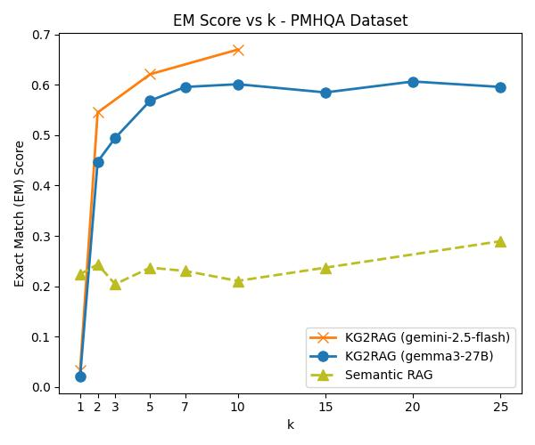
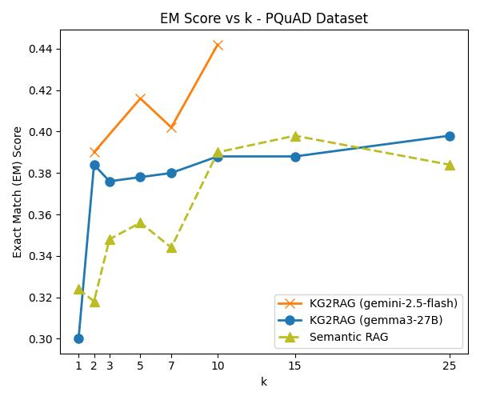

# LLM-Final-Project
This repo contain the codes of implementing HippoRAG and KG2RAG for persian PQUAD and PersianMHQA datasets.
## Evaluation Scripts
Results of Simple Semantic RAG are provided in:
* `results` folder

Results of KG2RAG are provided in:
* `output/KG2RAG` folder

## Methods
### Simple Semantic RAG
Using models below for evaluation:

* Embedding: Qwen3-Embedding-0.6B
* Generation: Gemma3-27B, gemini-flash-2.5
#### PersianMHQA Results:

| Method        | EM   | P    | R    | F1   | Acc  |
|---------------|------|------|------|------|------|
| **Retrieval** | 0.02 | 0.72 | 0.45 | 0.52 |  -   |
| **LLM**       | 0.13 | 0.17 | 0.21 | 0.18 | 0.43 |

#### PQuAD Results:

|      Method        | EM   | P    | R    | F1   | Acc  |
|--------------|------|------|------|------|------|
| **Retrieval**  | 0.43 | 0.52 | 0.63 | 0.56 |  -   |
| **LLM** | 0.40 | 0.66 | 0.59 | 0.60 | 0.45 |

### KG2RAG
#### PMHQA:

#### PQuAD:
